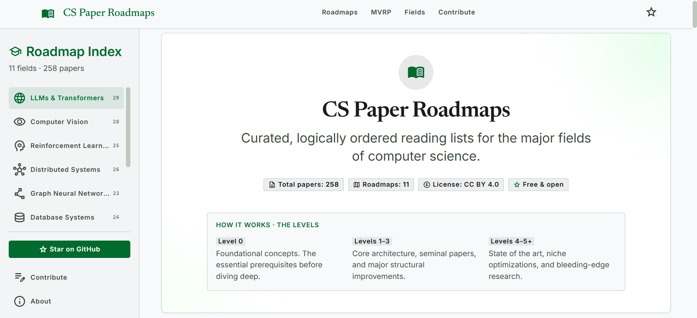

# CS Paper Roadmaps

> Curated, logically ordered reading lists for 11 major areas of computer science — every paper sequenced so each one builds on the last, with TL;DRs, prerequisites, and key takeaways.

<br/>

[](https://github.com/Achal13jain/cs-paper-roadmaps)
[](https://github.com/Achal13jain/cs-paper-roadmaps)
[](LICENSE-CONTENT)
[](CONTRIBUTING.md)
[](CONTRIBUTING.md)

<br/>

<br/>



🌐 **[Browse the interactive website →](https://achal13jain.github.io/cs-paper-roadmaps)**

> The website lets you filter papers by level, expand TL;DRs inline, and track your minimum viable reading path — all in one page.

<br/>

---

## How to Use This

Each roadmap is structured as a series of levels — **start at your current knowledge level** and read forward.

```
Level 0  →  Prerequisites & Foundations
Level 1  →  Core Architecture / Theory
Level 2  →  Scaling & Variants
Level 3  →  Efficiency & Systems
Level 4  →  Alignment / Advanced Techniques
Level 5+ →  Frontier & State of the Art
```

Every paper entry includes:

| Field | What it tells you |
|---|---|
| **TL;DR** | What the paper actually does in 2–3 sentences |
| **Why read this** | How it fits into the broader field and why it matters |
| **Prerequisites** | What to read first so you're not lost |
| **Key takeaway** | The single insight you should walk away with |
| **Link** | Always arXiv or open-access — never paywalled |

---

## Minimum Viable Reading Paths

Don't have time to read everything? Each roadmap has a curated **10-paper minimum viable path** — the papers that give you 80% of the understanding with 30% of the effort.

**Example — LLMs & Transformers:**

```
[04] Attention Is All You Need  →  [06] GPT-1  →  [08] GPT-2  →  [10] GPT-3
→  [15] InstructGPT  →  [18] LLaMA  →  [22] Chain-of-Thought
→  [24] RAG  →  [26] LoRA  →  [29] Llama 3
```

---

## Repository Structure

```
cs-paper-roadmaps/
│
├── README.md
├── index.html                        ← auto-generated; do NOT edit manually
├── papers.yml                        ← single source of truth — EDIT THIS
├── CONTRIBUTING.md
├── LICENSE-CODE
├── LICENSE-CONTENT
├── scripts/
│   ├── validate_papers.py            ← schema validation
│   ├── check_links.py                ← link health checker
│   ├── generate_html.py              ← regenerates index.html from papers.yml
│   └── README.md
└── .github/
    ├── workflows/
    │   ├── validate-pr.yml           ← runs on every PR
    │   ├── build-site.yml            ← runs on merge to main
    │   └── greet-contributor.yml     ← welcome message on new PRs
    ├── ISSUE_TEMPLATE/
    │   ├── suggest-paper.yml
    │   └── suggest-topic.yml
    └── PULL_REQUEST_TEMPLATE.md
```

---

## Contributing

Contributions are very welcome. If you know a paper that belongs in a roadmap, a TL;DR that could be sharper, or a new field that deserves its own list, please open a PR.

**To add a paper:**

1. Fork the repo
2. Edit `papers.yml`
3. Add the paper in the correct roadmap and level
4. Fill in `tldr`, `why`, `prerequisites`, and `key_takeaway`
5. Open a PR with the title: `[Add Paper] Field — Paper Title`

**Rules:**
- Links must point to arXiv, the author's page, or another open-access source — **never a paywall**
- One paper per PR keeps reviews fast
- Papers must be peer-reviewed or widely cited in the field
- Do not edit `index.html` in paper PRs; it is generated from `papers.yml`

See [CONTRIBUTING.md](CONTRIBUTING.md) for the full guide.

---

## FAQ

**Why not just use Semantic Scholar / Papers With Code?**

Those are great for discovery. This is for *sequenced learning* — knowing what to read *in what order* and *why* each paper matters before you open it.

**Are these the only important papers?**

No. These are the papers that build the clearest conceptual path through each field. Some influential papers are omitted if they're superseded or better understood after the ones listed. PRs for missing papers are welcome.

**Is this kept up to date?**

Yes — the goal is to add new frontier papers within a few months of publication. Watch the repo or check the commit history for recent additions.

**Can I use this for a university course or reading group?**

Absolutely. All content is under CC BY 4.0 — you can use, adapt, and share it with attribution.

---

## Star History

If you find this useful, starring the repo is the best way to help others discover it.

---

## License

All bibliographic information (titles, authors, dates) and links are factual and not subject to copyright. All original commentary, TL;DRs, and descriptions in this repository are licensed under [CC BY 4.0](LICENSE-CONTENT).

All linked papers remain the intellectual property of their respective authors and publishers. This repository contains no paper content — only links and original commentary.

---

<div align="center">

Made with the belief that great research should be accessible to everyone.

[Website](https://Achal13jain.github.io/cs-paper-roadmaps) · [Contribute](CONTRIBUTING.md) · [Issues](https://github.com/Achal13jain/cs-paper-roadmaps/issues)

</div>
